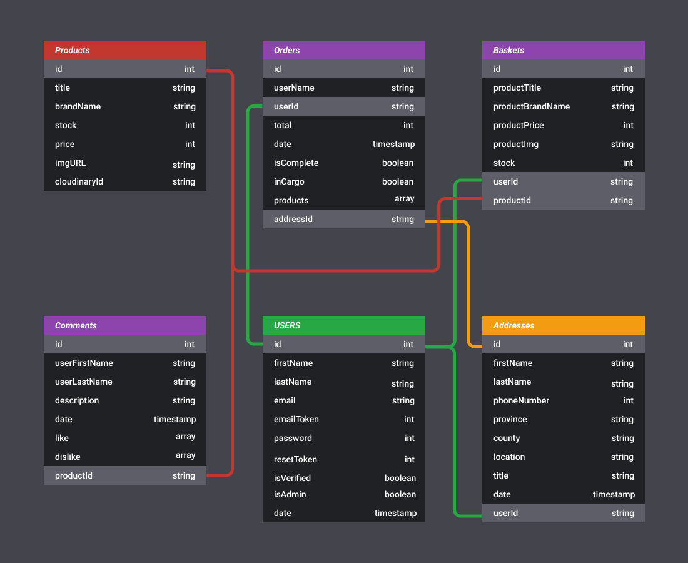
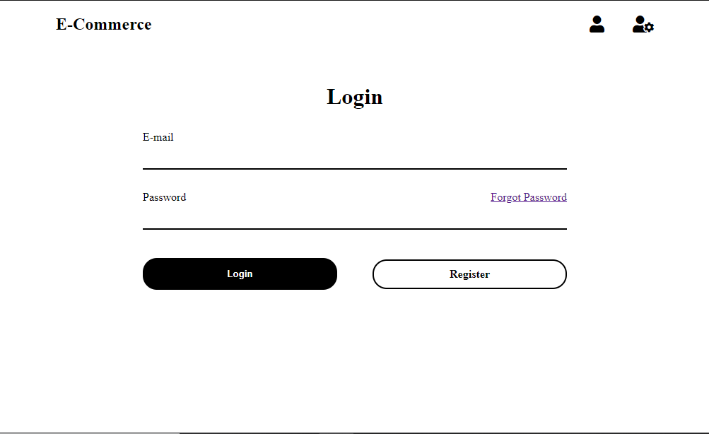
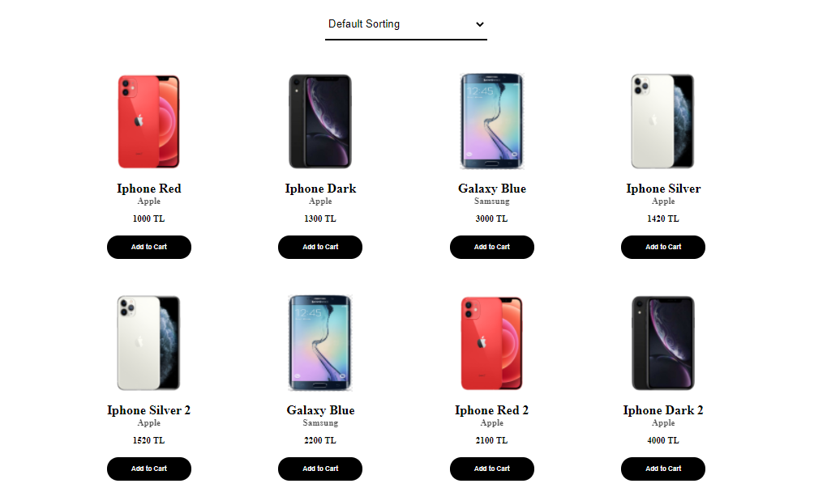
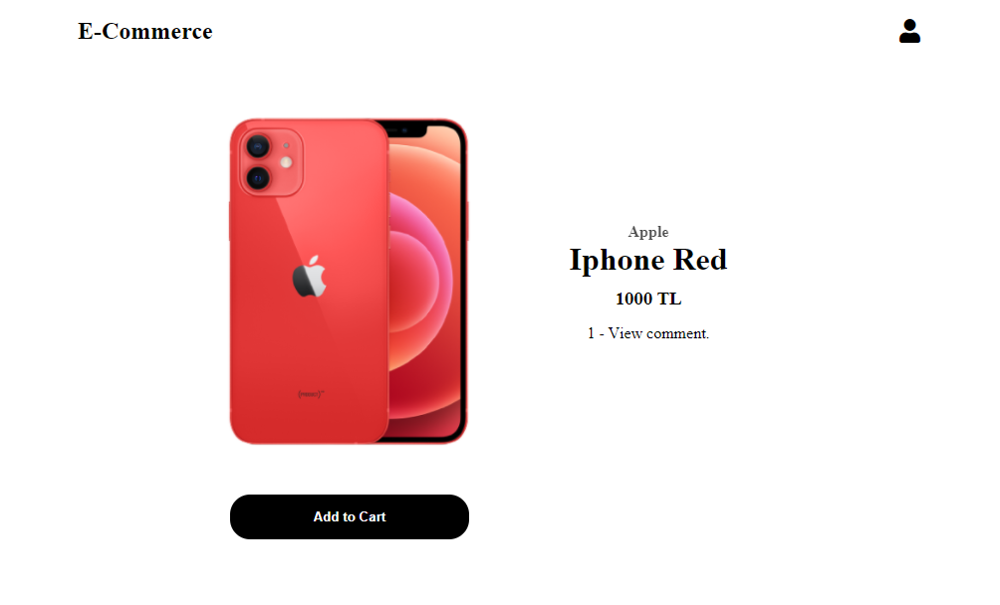

# Full Stack E-Commerce App

> This app is built with mongodb, nodejs, expressjs and vuejs

## Operations

- Authentication with JWT
    - Login
    - Register  
    - Verify email
    - Forgot Password
- Address (CRUD)
    - Create address
    - Delete address
    - Update address
- Product
    - Add to cart
    - Create comment
    - Like comment
    - Dislike comment
- Cart
    - Plus product piece
    - Minus product piece
    - Take out of basket
    - Confirm cart
    - Complete Order
- Admin
    - Users
        - Deactive action
        - Active action
        - Delete action
    - Products
        - Create product
        - Delete product
        - Update product
    - Orders
        - In cargo
        - Delivered

## Database Model

Though the diagram uses sql data type, this diagram is to show you the various collections in the mongo database.



## Tech Stack

- MongoDB
- NodeJS
- ExpressJS
- VueJS

## Configuration File

Modify to your environment variables from docker-compose.yml

```
- Server
MONGODB_CONNECTION_STRING = YOUR_URL
SENDGRID_API = YOUR_API ( Free E-mail service )
CLOUDINARY_CLOUD_NAME = YOUR_CLOUDINARY_NAME
CLOUDINARY_API_KEY = YOUR_CLOUDINARY_API_KEY
CLOUDINARY_API_SECRET = YOUR_CLOUDINARY_API_SECRET

- Client
VUE_APP_API_URL = YOUR_API_URL
```

## Installation

If you have Docker Desktop

```console
docker-compose up
```

If you don't have Docker Desktop

Install all npm dependecies from server file

```console
cd server && npm install
```

Install nodemon globally

```console
npm install  -g nodemon
```

Start development server
```console
npm start
```

Install all npm dependecies from client file

```console
cd ./client && npm install
```

Start development client
```console
npm run serve
```

## Screenshots

### Sign In



### Home Page



### Specific Product Page



For more screenshots check out the demo link [Live Demo](https://ecommerce-project-frontend.herokuapp.com)

## License

This project is licensed under the MIT License

## Developed by Gorkem Basbug

Reach me on linkedin [@gbasbu](https://www.linkedin.com/in/gbasbu/)
